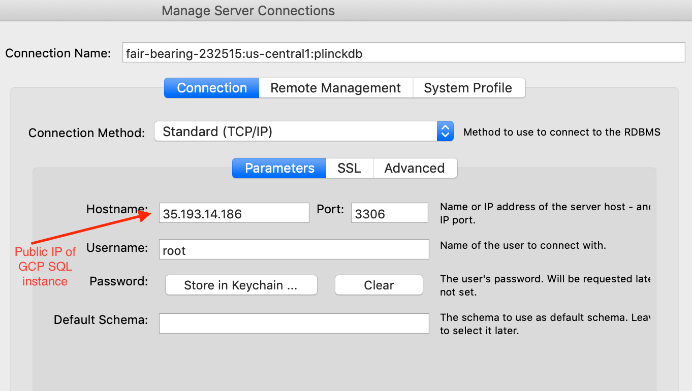
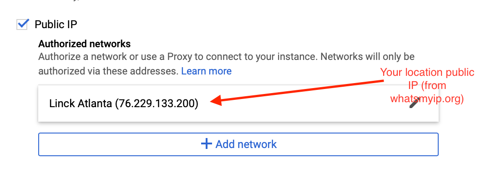

# helloWorld

## Overview

I wrote this app just to learn how to deploy a node.js app with mySQL to google cloud platform.  All this app does is show an HTML page and when you click the `get message` button it fetchses all the *worlds* from the helloworld_db and prints a message `Hello world.name` for every world in the worlds table.  

A few things to note.  The DB connection info is stored in the `.env` file to test using local DB so that file **should NOT** be saved in source conrol (make sure it is in .gitignore).  The server side/GCP (Google Cloud Platform) DB connection info is stored in the env section of the `app.yaml` file so that should also **NOT** be stored in source control (i.e. git -- make sure you add `*.yaml` to .gitignore).

* NOTE: To connect mySQL Workbench to the GCP SQL Datastore you have to get the public IP from the connection instance info on the GCP SQL Dashboard service.  You also have to authorize your IP address to be able to access that DB (use whatsmyip.org to get your IP address).




### Other notes

* Make sure you put your database in the same app engine/project as your node.js app and make sure its in the same region (e.g. `us-central1`).  This allows allow GCP to use local sockets to connect to the DB.
* I added the app engine using the GCP dashboard on the web but it can be done using gcloud commands
* You can also connect to the GCP SQL database from your local app using a proxy but I did not do that - i use local DB when testing locally
* When you add the project, you set it up as node.js for the appengine so it know the proper enviroment.
* The `app.yaml` file is the key to deployment.  Then to deploy, you just run `gcloud app delpoy` to send to GCP.  You can lookup the setup of `app.yaml` on the web but here is what mine scrubbed looks like

```yaml
runtime: nodejs
env: flex
# This sample incurs costs to run on the App Engine flexible environment.
# The settings below are to reduce costs during testing and are not appropriate
# for production use. For more information, see:
# https://cloud.google.com/appengine/docs/flexible/nodejs/configuring-your-app-with-app-yaml
manual_scaling:
  instances: 1
resources:
  cpu: 1
  memory_gb: 0.5
  disk_size_gb: 10

# [START gae_mysql_env]
# The following env variables may contain sensitive information that grants
# anyone access to your database. Do not add this file to your source control.
env_variables:
  SQL_USER: [dbusername]
  SQL_PASSWORD: [dbpassword]
  SQL_DATABASE: helloworld_db
  # e.g. my-awesome-project:us-central1:my-cloud-sql-instance
  INSTANCE_CONNECTION_NAME: fair-bearing-232515:us-central1:plinckdb
# [END gae_mysql_env]

beta_settings:
  # The connection name of your instance, available by using
  # 'gcloud beta sql instances describe [INSTANCE_NAME]' (plinckdb) or from
  # the Instance details page in the Google Cloud Platform Console.
  cloud_sql_instances: fair-bearing-232515:us-central1:plinckdb
```

## TO DO

* Add all the steps one by one that explains how I made this work fromn createing the appEngine, project, Database and the key parts of the code and deloyment steps.